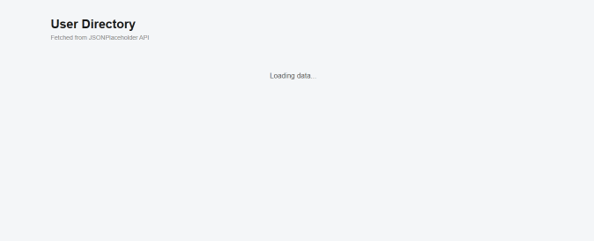
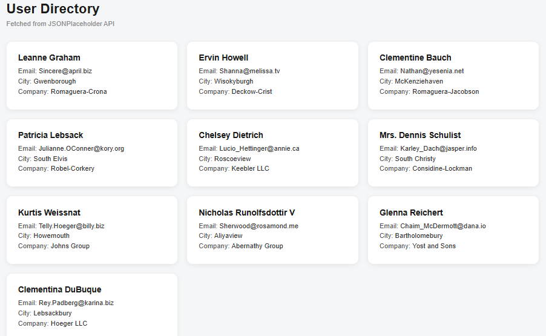
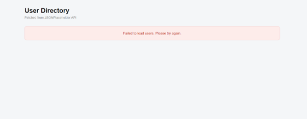

# Data Viewer — Fetch an API & Render Dynamic Content

## Overview
A web application that fetches user data from a public API and displays it dynamically as a card grid. Built as part of Week 2 of the Sohail Smart Solutions internship, this project focuses on asynchronous JavaScript, the Fetch API, and component-based UI structure.

## Features
- Fetches live data from JSONPlaceholder API
- Displays user name, email, city, and company for each user
- Loading state shown while the request is in progress
- Error state shown if the fetch request fails
- Responsive card grid layout

## Technologies Used
- HTML5
- CSS3
- JavaScript (Fetch API, async/await, DOM manipulation)

## Project Structure
'''
data-viewer/

├── css/

│   └── style.css

├── js/

│   ├── api.js

│   └── ui.js

├── assets/

│   ├── loading-state.png

│   ├── cards-rendered.png

│   └── error-state.png

└── index.html
'''
## How to Run
1. Clone the repository
2. Open `data-viewer/index.html` in your browser
3. The application will fetch and display user data automatically

## Screenshots

### Loading State

### Cards Rendered

### Error State

## Learning Outcomes
- How the Fetch API sends requests and handles responses
- The difference between awaiting fetch() and awaiting .json()
- Managing loading and error states during asynchronous operations
- Separating fetch logic and UI logic into different files
- Building reusable component functions in vanilla JavaScript
