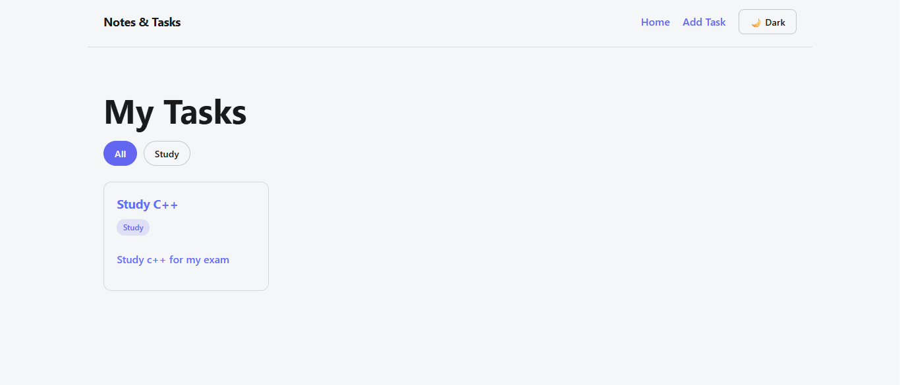
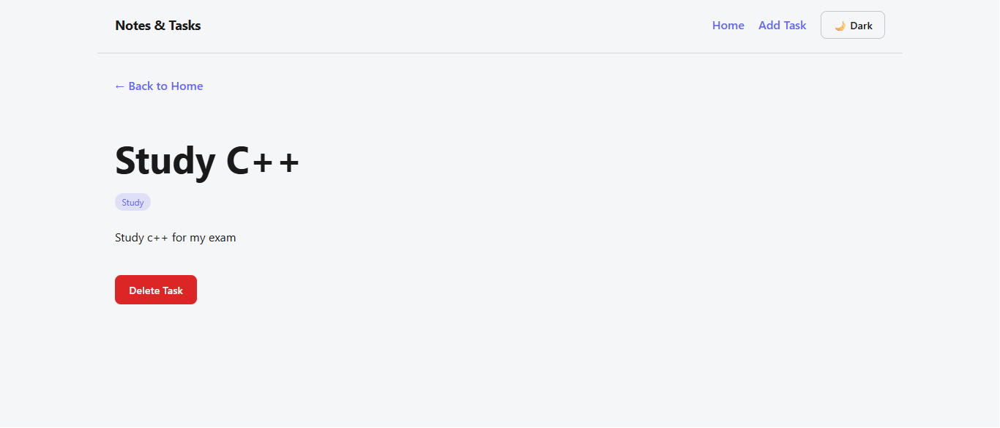
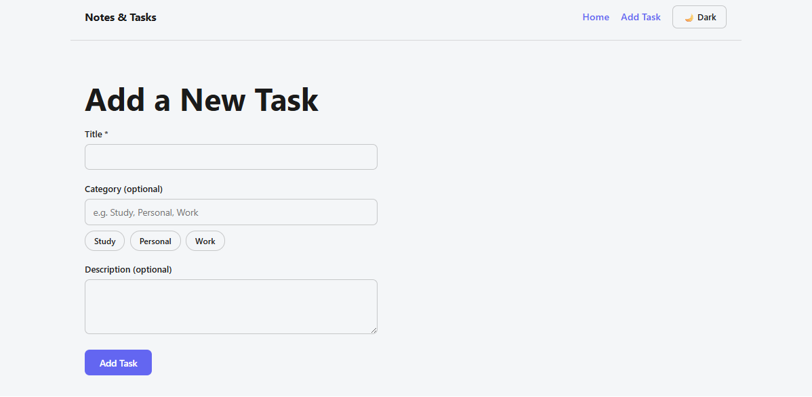

# Notes & Tasks

A full-stack task management app built with React and a custom Express backend. Add tasks with an optional category and description, browse them as a filterable card list, view full details on a dedicated page, edit existing tasks, and delete tasks you no longer need. All data is now stored and served by a real API instead of the browser's localStorage, and the entire app supports light and dark themes through React Context.

This project was originally planned and built independently as a capstone during Week 5 of a web development internship, using localStorage for persistence. In Week 6, it was extended into a full-stack application: a custom Node.js/Express REST API was built from scratch and the frontend was rewired to read from and write to that API instead of the browser, completing the full CRUD loop (Create, Read, Update, Delete).

## Features

- Add tasks with a title (required), category (optional), and description (optional)
- Controlled form with inline validation on submission
- Browse all tasks in a responsive card grid
- Filter tasks by category, generated dynamically from existing task data
- View full task details on a dedicated page via dynamic routing
- Edit an existing task's title, category, and description
- Delete tasks from the detail page
- All task data is fetched from and persisted to a custom Express backend
- Loading, empty, and error states handled for every operation (fetch, create, update, delete)
- Light and dark theme toggle, shared globally via Context
- "Not found" handling for invalid task IDs

## Tech Stack

- React (Vite)
- React Router DOM
- React Context API
- Fetch API, connected to a custom Express backend
- CSS (custom, no framework)

## Backend

This app is powered by a custom REST API built with Node.js and Express, located in the [`/backend`](../backend) folder of this repository. Full backend setup instructions and endpoint documentation are in the [backend README](../backend/README.md).

### API Endpoints Used

| Method | Endpoint | Used For |
| --- | --- | --- |
| GET | `/api/tasks` | Loading all tasks when the app starts |
| POST | `/api/tasks` | Creating a new task |
| PUT | `/api/tasks/:id` | Updating an existing task |
| DELETE | `/api/tasks/:id` | Deleting a task |

## Screenshots

**Home Page**

**Task Detail Page**

**Add Task Page**

## Project Structure

- `notes-tasks-app/`
  - `src/`
    - `components/`
      - `CategoryFilter.jsx`
      - `Navbar.jsx`
      - `TaskCard.jsx`
    - `context/`
      - `TaskContext.jsx`
    - `pages/`
      - `AddTask.jsx`
      - `EditTask.jsx`
      - `Home.jsx`
      - `TaskDetail.jsx`
    - `App.jsx`
    - `App.css`
    - `index.css`
    - `main.jsx`
  - `vite.config.js`
  - `package.json`

## How to Run Locally

This app requires the [backend server](../backend) to be running for it to load or save any data.

1. Clone the repository and navigate into the project folder:
git clone https://github.com/Qadoory123/aurak-internship-web-development.git
cd aurak-internship-web-development/notes-tasks-app
2. Install dependencies:
npm install
3. Start the development server:
npm run dev
4. Open the local URL shown in the terminal (usually `http://localhost:5173`)

**Note:** The frontend currently points to a fixed backend URL hardcoded in `src/context/TaskContext.jsx`, set up for this project's CodeSandbox development environment. To run against a locally running backend instead, update the `API_URL` constant in that file to point to your backend's address (typically `http://localhost:5000/api/tasks`). Moving this to an environment variable is a planned improvement.

## State Architecture

The `tasks` array and `theme` value both live in Context, since they're needed across multiple unrelated pages and components. The category filter value stays as local state inside the Home page, since only Home needs to know the currently selected filter. As of Week 6, the `tasks` array is no longer read from or synced to localStorage; instead, `TaskContext` fetches tasks from the backend on mount and sends create, update, and delete requests directly to the API, updating local state only after each request succeeds.

## What I Learned

Building the original version of this project independently, without a guided daily structure, required deciding the state architecture myself before writing any code, specifically which state belongs in Context versus local state. It also reinforced patterns from earlier weeks, useParams, useNavigate, controlled forms, and Context, by applying them to a new data model rather than following a set structure.

Extending it into a full-stack app in Week 6 shifted the challenge from frontend architecture to integration: replacing localStorage with real HTTP requests meant every operation now had to account for network failure, not just empty or invalid input. Handling loading and error states for create, update, and delete, not just the initial fetch, made the app noticeably more realistic and closer to how production software actually has to behave.

## Deployment

The version of this app deployed at the previous live link (`notes-tasks-app-mu.vercel.app`) reflects the earlier localStorage-based build from Week 5, not the current full-stack version. Since this app now depends on a backend running locally in CodeSandbox rather than a permanently hosted server, a new deployment of the full-stack version is not yet live. Deploying the frontend to a static host alongside a permanently hosted backend is a planned next step.

## GitHub Repository

[https://github.com/Qadoory123/aurak-internship-web-development](https://github.com/Qadoory123/aurak-internship-web-development)
