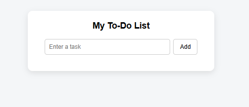
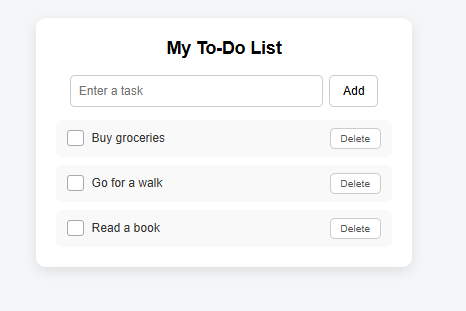
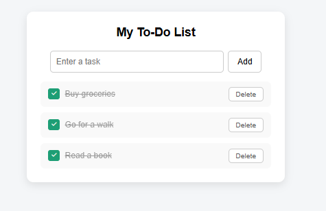
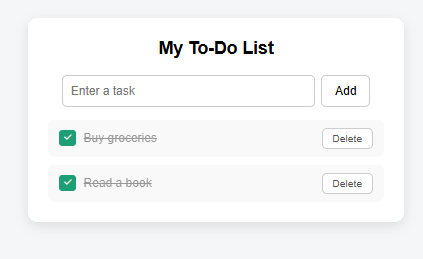

# To-Do List Web Application

## Overview
A simple interactive To-Do List web application built using HTML, CSS, and JavaScript. Users can add, complete, and delete tasks dynamically in the browser without any page refresh. Built as part of Week 1 of the Sohail Smart Solutions internship to demonstrate fundamental web development skills including DOM manipulation, event handling, and UI design.

## Features
- Add new tasks dynamically
- Mark tasks as completed with a visual indicator
- Delete tasks
- Keyboard support — press Enter to add a task
- Real-time updates without page refresh

## Technologies Used
- HTML5 (structure)
- CSS3 (styling)
- JavaScript (DOM manipulation & event handling)

## Project Structure
todo-app/

├── index.html

├── style.css

└── script.js

## How to Run
1. Clone the repository
2. Open `todo-app/index.html` in your browser
3. Start adding tasks

## Screenshots

### Empty App

### Task Added

### Task Completed

### Task Deleted

## Learning Outcomes
- DOM manipulation and dynamic element creation
- Event handling with addEventListener()
- Managing UI state using CSS classes
- Structuring a front-end project with separate HTML, CSS, and JavaScript files
